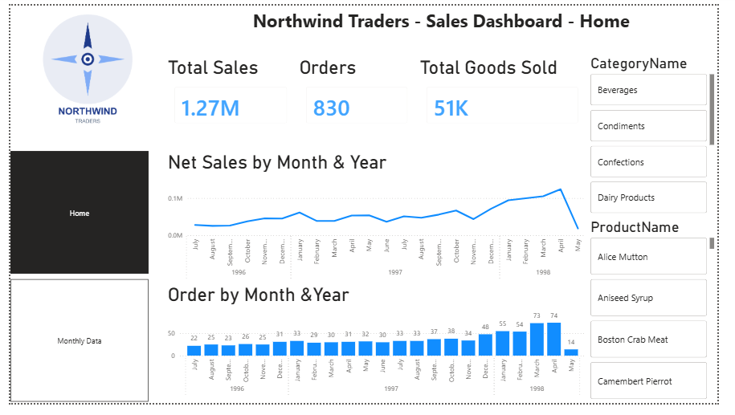

# Northwind Traders Sales Dashboard

## 📊 Project Overview

An interactive Power BI dashboard created to analyze Northwind Traders' sales performance.

The dashboard provides insights into total sales, orders, goods sold, monthly sales trends, daily sales performance, and freight charges.

## 🛠️ Tools Used

- Power BI
- DAX
- Power Query
- GitHub

## 📈 Key KPIs

- Total Sales
- Total Orders
- Total Goods Sold
- Net Sales
- Freight Charges

## 📑 Dashboard Pages

### 1. Home – Sales Overview

The Home page provides an overall view of sales performance.

Key components:

- Total Sales
- Orders
- Total Goods Sold
- Net Sales by Month & Year
- Orders by Month & Year
- Category filter
- Product filter



### 2. Monthly Trends

The Monthly Trends page provides a more detailed analysis of sales performance.

Key components:

- Total Sales
- Orders
- Total Goods Sold
- Net Sales by Day
- Freight Charges by Order ID
- Category filter
- Product filter


## 🧮 DAX Formulas

### Net Price

```DAX

NetPrice =
(FactOrders[UnitPrice] * FactOrders[Quantity])
    * (1 - FactOrders[Discount])

TotalSales =
SUM(FactOrders[NetPrice])

Month_Name =
FORMAT(DimDate[Full_Date], "MMMM")
(FactOrders[UnitPrice] * FactOrders[Quantity])
    * (1 - FactOrders[Discount])
