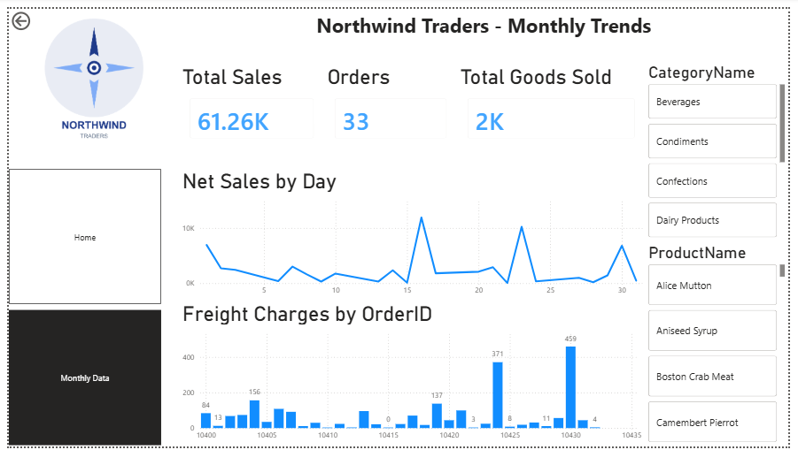
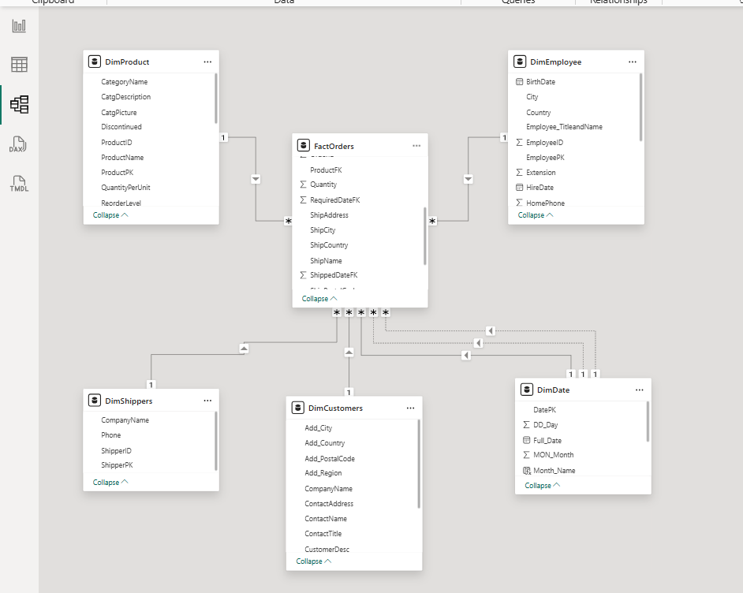

# 📊 Northwind Traders – Sales Analytics Dashboard

An interactive **Power BI Sales Analytics Dashboard** developed to analyze
Northwind Traders' sales performance, order activity, product performance,
and monthly sales trends.

## 🚀 Project Overview

The objective of this project is to transform sales data into meaningful
business insights using:

- Power BI
- DAX
- Data Modeling
- KPI Cards
- Interactive Filters
- Sales Trend Analysis
- Product Analysis
- Time Intelligence

## 📌 Dashboard Features

### 🏠 Home Dashboard

The Home page provides an overview of overall business performance.

Key KPIs:

- Total Sales
- Total Orders
- Total Goods Sold
- Net Sales by Month & Year
- Orders by Month & Year
- Product Category Filter
- Product Name Filter

### 📈 Monthly Trends

The Monthly Trends page provides a detailed view of:

- Total Sales
- Orders
- Total Goods Sold
- Net Sales by Day
- Freight Charges by Order ID
- Product Category filtering
- Product Name filtering

## 🗂️ Data Model

The dashboard uses a dimensional data model consisting of:

- FactOrders
- DimProduct
- DimCustomers
- DimEmployee
- DimShippers
- DimDate

The model follows a **star-schema approach**, with FactOrders
serving as the central fact table and dimension tables providing
descriptive information.

## 🧮 DAX & Analysis

The dashboard uses DAX calculations to calculate important sales metrics.

### 1. Net Price

Calculates the net value of each order after applying the discount.

```DAX
NetPrice =
(FactOrders[UnitPrice] * FactOrders[Quantity])
    * (1 - FactOrders[Discount])

TotalSales =
SUM(FactOrders[NetPrice])

Month_Name =
FORMAT(DimDate[Full_Date], "MMMM")
```

## 📊 Dashboard Preview

### Home Dashboard


### Monthly Trends



### Data Model



## 🛠️ Tools Used

| Tool | Purpose |
|---|---|
| Power BI | Dashboard & Visualization |
| DAX | Calculations & Measures |
| Power Query | Data Transformation |
| Data Modeling | Relationships & Star Schema |
| Excel | Data Source |

## 📁 Repository Structure

```text
Northwind-Traders-Sales-Dashboard/
│
├── README.md
├── PowerBI/
│   └── Northwind_Traders_Sales_Dashboard.pbix
│
├── Screenshots/
│   ├── Dashboard_Home.png
│   ├── Monthly_Trends.png
│   └── Data_Model.png
│
└── Dataset/
    └── Northwind_Dataset.xlsx
```

## 👤 Author

### Ankit Singh Mahar
